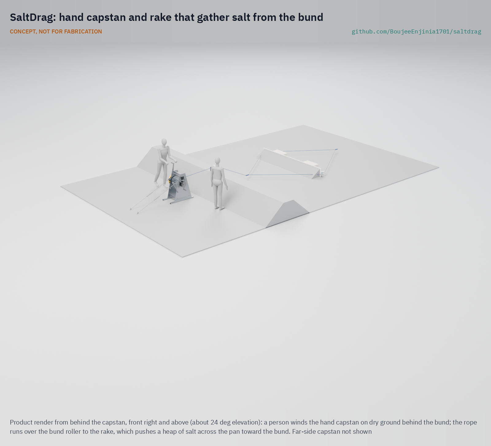
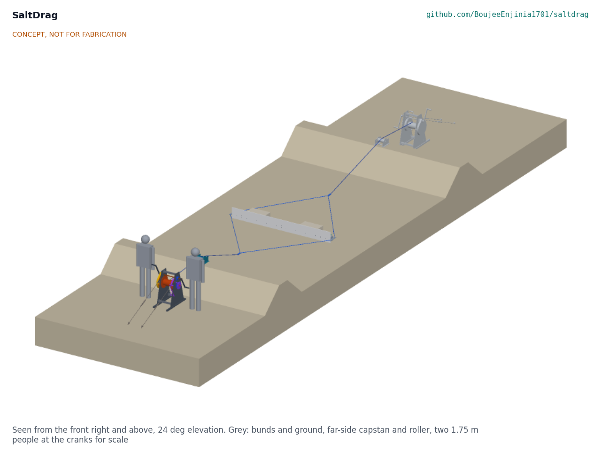
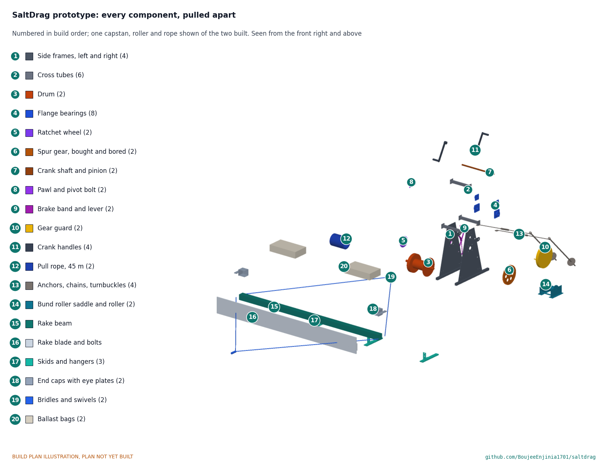

# SaltDrag

     

**Area:** Food and water security · **TRL:** 3 of 9 (analytical proof of concept, constructable design) · **Value-engineering target:** USD 4,000; estimated cost USD 2,803 · **Difficulty:** 3 of 5

[Exploded render](media/render-exploded.png) · [Detail render](media/render-detail.png) · [Interactive 3D model](media/viewer.html) · [Concept blueprint (PDF)](media/concept-blueprint.pdf)

Drags a rake across the salt pan with hand capstans on the bunds so workers stay out of the brine.

CONCEPT, NOT FOR FABRICATION: a TRL 3 design documented for building and testing, not a released or certified product.

## Concept rationale

Agariya families make salt by hand, and their own words describe the cost: from extreme winter to blazing sun they bear it all, and end up with grave injuries from constantly handling salt ([Mongabay India, 2021](https://india.mongabay.com/2021/10/when-salt-is-an-essential-commodity-and-salt-makers-are-not/)). SaltDrag moves the hardest part of the harvest out of the pan. A wide rake is laid across the pan and drawn over the crystal bed by ropes from two hand capstans set on the bunds. Workers wind the capstans from dry ground and the rake gathers the salt toward the bund, instead of people standing in the brine to scrape it.

It is hand powered on purpose. Agariyas received registration cards in 2023 on condition that they keep bunds to two feet and avoid machine use ([ICSF](https://icsf.net/newss/gujarat-in-kutch-booming-salt-business-puts-traditional-salt-agariyas-up-against-ginger-prawn-fishers/)), so a motorised harvester is not an option for them. A capstan and rake set that a local fabricator can build, within a prototype ceiling of $4,000 USD, and that a group of families can share, fits both the rules and the budget of a community that earns a small fraction of the retail price of its salt.

## Burning platform

About 60,000 Agariyas in the Little Rann of Kutch produce 30 per cent of India's inland salt, migrating to the pans for eight months a year; preparing each pan takes 40 to 45 days of manual work, and they earn about Rs 0.30 per kilogram for salt that retails at about Rs 20 ([Mongabay India, 2021](https://india.mongabay.com/2021/10/when-salt-is-an-essential-commodity-and-salt-makers-are-not/)). Salt pan workers there face severe health issues from working in harsh conditions for six to seven months at a stretch ([Wikipedia, citing The Diplomat](https://en.wikipedia.org/wiki/Little_Rann_of_Kutch)).

The collection season falls in the extreme heat of March and April ([Press Institute of India](https://pressinstitute.in/grassroots/traditional-salt-workers-contribute-to-wild-ass-conservation-and-regain-access-to-little-rann-of-kutch/)). Protective gear such as gumboots and caps has reached women workers through NGOs rather than employers ([Scroll.in](https://scroll.in/article/1007602/gujarats-plan-to-build-asias-biggest-freshwater-lake-is-a-threat-to-agariya-salt-workers)). The one big change in recent years, solar brine pumps, shows that the right hardware spreads fast: about 80 per cent of 7,000 Agariya families now have at least one solar pump ([Down To Earth](https://www.downtoearth.org.in/news/renewable-energy/great-change-in-little-rann-how-salt-workers-on-the-brink-in-gujarat-brought-about-a-solar-revolution-80652)). Harvesting has had no equivalent.

## Where it could be used

### By industry

| Industry | Use |
| --- | --- |
| Small-scale solar salt production | Gathering crystallised salt from inland and coastal pans without standing in brine |
| Cooperatives and producer groups | Shared harvest kit for a cluster of family pans |
| NGOs and livelihood programmes | Occupational health intervention alongside solar pumps and protective gear |
| Artisanal salt and specialty salt makers | Gentle, even gathering of large crystals from shallow pans |
| Evaporation pond operators | Low-cost manual scraping of small ponds and settling beds |

### By country or region

| Country or region | Why it matters there |
| --- | --- |
| India, Little Rann of Kutch | About 60,000 Agariyas produce 30 per cent of India's inland salt there by hand ([Mongabay India, 2021](https://india.mongabay.com/2021/10/when-salt-is-an-essential-commodity-and-salt-makers-are-not/)). |
| India, villages around the Rann | Agariyas migrate each season from 102 villages 7 to 45 km away, and 17.5 lakh people in the area depend on salt ([Scroll.in](https://scroll.in/article/1007602/gujarats-plan-to-build-asias-biggest-freshwater-lake-is-a-threat-to-agariya-salt-workers)). |
| India, Kutch coastal creeks | Salt works around Hadakiya Creek grew from 2,962 ha in 1995 to 15,950 ha in 2015, while Agariya registration requires two-foot bunds and no machine use ([ICSF](https://icsf.net/newss/gujarat-in-kutch-booming-salt-business-puts-traditional-salt-agariyas-up-against-ginger-prawn-fishers/)). |
| India, Gujarat | Gujarat produces 76 per cent of India's salt ([Press Institute of India](https://pressinstitute.in/grassroots/traditional-salt-workers-contribute-to-wild-ass-conservation-and-regain-access-to-little-rann-of-kutch/)). |

## What sparked the idea

An Agariya salt maker in the Little Rann of Kutch described the work this way: except pumping brine from the wells, everything is done manually, and "from extreme winter to blazing sun, we bear it all. And end up with grave injuries by constantly handling salt" ([Mongabay India, 2021](https://india.mongabay.com/2021/10/when-salt-is-an-essential-commodity-and-salt-makers-are-not/)). Solar pumps have changed the brine side of that sentence. SaltDrag is aimed at the other side: the handling.

## Problem

Small-scale salt makers such as the Agariyas of the Little Rann of Kutch gather crystallised salt by hand, working inside the pans for months in extreme heat and cold. There is no low-cost, non-motorised tool that lets them gather salt from the dry bund instead.

Full problem statement: [docs/01-problem.md](docs/01-problem.md)

## Concept

A 3 m rake is drawn across the salt pan by a rope from a hand capstan standing on dry ground behind the bund; the rope runs over a roller on the bund crest, and a second capstan on the far bund holds the rake straight and winds it back. Two people at 89 N each on 330 mm cranks pull a full heap of about 230 kg across a 30 m pan in under ten minutes (estimates, SDG-CAL-001). Every load-bearing part keeps at least a 2.1 margin at twice the rated 3 kN pull. The gathering rate against the traditional dantala is not yet known: it needs a baseline measured on a partner's pan.

Full design precis: [docs/02-concept.md](docs/02-concept.md) · Requirements: [docs/03-requirements.md](docs/03-requirements.md) · Calculations: [docs/04-calcs/01-sizing.md](docs/04-calcs/01-sizing.md) · Prototype build plan: [docs/05-build-plan.md](docs/05-build-plan.md) · Design decisions: [docs/06-design-decisions.md](docs/06-design-decisions.md) · General arrangement: [cad/drawings/SDG-DWG-001.pdf](cad/drawings/SDG-DWG-001.pdf) · 3D viewer: [media/viewer.html](media/viewer.html)

## Key components

- Hand capstans (two): geared drum winches, 6 to 1, with ratchet and pawl, band brake and gear guard
- Screw-in ground anchors and chains
- Bund roller saddles (two)
- Rake: 3.0 m FRP beam, 300 mm UHMW-PE blade, three skids, stainless end caps
- Pull ropes (12 mm polyester, 45 m each), bridles and swivels
- Rope dampers and ballast bags
- Maintenance kit

## Building the prototype

The build plan ([docs/05-build-plan.md](docs/05-build-plan.md)) takes a town fabrication shop through all 20 kinds of component in build order, with a making sketch for each made part, close-ups of the joints and a picture for every one of the 18 assembly steps. The capstans are cut, drilled and welded from steel plate and box section and then galvanised; the gears, bearings, anchors and ropes are bought; the rake is drilled FRP and plastic with stainless fittings. The plan is a plan, not yet built: it ends with first checks and the safety stops before any rope is loaded. The parts cost about USD 2,803 against a value-engineering target of USD 4,000.

## Safety

> Ropes under load can snap back. The design uses certified low-stretch polyester rope (working-load factor 7.7), a damper bag on every loaded rope and a 2 m exclusion zone along the rope line.
>
> Capstans have a pawl that is always engaged while winding, so a released crank cannot spin back; rope is paid out only on the band brake, with the crank handles removed. The gears run inside a guard.
>
> Ground anchors are proof-loaded on site before first use; the build plan lists safety stops before any rope load.
>
> Heat is a serious hazard in the harvest season; plan work for cooler hours and provide shade and water.
>
> Published as an open engineering reference, never as certified lifting or rope equipment.
>
> This design is published as an open engineering reference. It is not certified equipment.

## Repository layout

| Folder | Contents |
| --- | --- |
| `docs/` | Problem, concept, requirements, calculations, build plan and design decisions |
| `cad/src/` | build123d Python source, the source of truth for all geometry |
| `cad/step/`, `cad/stl/` | Exported models for FreeCAD, other CAD tools and printing |
| `cad/drawings/` | 2D sketches and dimensioned drawings |
| `bom/` | Bill of materials |
| `electronics/` | KiCad schematics and PCB layouts |
| `firmware/` | Microcontroller code |
| `media/` | Renders, perspectives and photos |
| `build-log/` | Dated prototyping notes |

## Documentation

Controlled documents follow the portfolio [documentation standard](.kit/STANDARDS.md). Each carries a document ID (SDG-PRC-001 for the precis), a version and a revision history. Branded PDFs are built with `python .kit/render.py` and attached to GitHub Releases when a document is tagged, for example `SDG-PRC-001/v1.0`.

## Credits

Designed by Amish Chadha at Design Molecule Labs. See [CONTRIBUTORS.md](CONTRIBUTORS.md) for roles. To cite this design, use [CITATION.cff](CITATION.cff) (GitHub shows it as "Cite this repository").

AI assistance (Claude) was used to accelerate prototype documentation and first-pass research. Design direction and all decisions are Amish Chadha's, recorded in this repository's decision records (`docs/decisions/`).

## Licenses

- **Hardware** (CAD, drawings, BOM, electronics): [CERN-OHL-S v2](LICENSE)
- **Software** (firmware, scripts, notebooks): [MIT](LICENSE-SOFTWARE)

A project of the [Design Molecule](https://designmolecule.com) lab.
