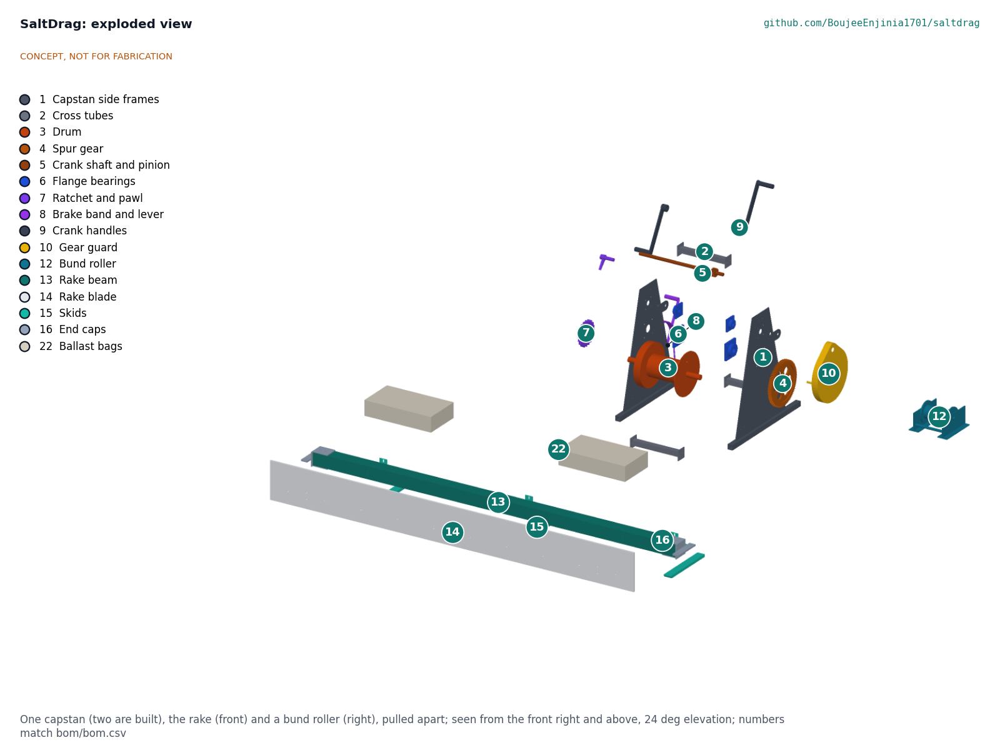
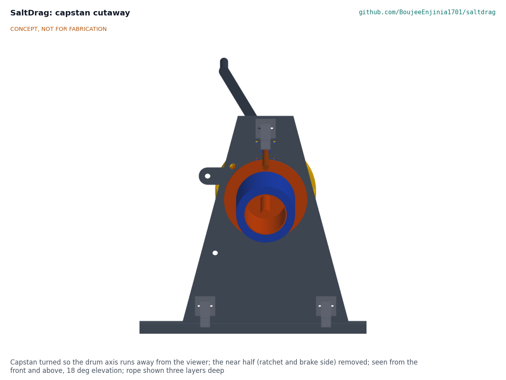
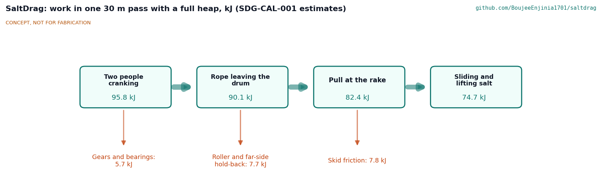

# SaltDrag design precis

Drags a rake across the salt pan with hand capstans on the bunds so workers stay out of the brine.

*Figure 1. The working layout on a pan shortened to 7 m for the picture: the near capstan and bund roller in colour, the far-side set in grey, two 1.75 m people at the cranks for scale (concept media, SDG-DWG-010).*

## How it works

Two people winding a hand capstan on dry ground behind one bund draw a 3 m rake across the pan by a rope that runs over a roller on the bund crest. The rake's plastic blade rides 10 mm above the floor on three skids and pushes the loose salt crystals ahead of it into a heap of about 230 kg. At the near bund the steepening rope starts to lift the rake about 3.3 m from the bund toe, so the heap is left there as a windrow. A second capstan on the far bund holds a light back tension while the rake is pulled in, then winds it back empty. Both capstans then move 3 m along their bunds, and the return pull brings the rake onto the next strip. Nobody stands in the brine or walks on the pan at any stage.

Each capstan is a geared hand winch: two cranks drive a 14-tooth pinion, which turns an 84-tooth gear on the drum shaft (6 to 1). A pawl on a ratchet wheel stops the drum running back whenever the cranks are let go, and a band brake lets the far capstan pay out rope under control. Two chains from ears on the side frames, at rope height, hold the capstan to two screw-in ground anchors behind it.

*Figure 2. One capstan, the rake and a bund roller pulled apart; numbers match bom/bom.csv.*

*Figure 3. Capstan with its ratchet and brake side removed, showing the drum, flanges and three layers of rope.*

## Components

*Table 1. Main components (two capstans, two rollers and two ropes in a set).*

| BOM | Component | Role |
| --- | --- | --- |
| 1, 2 | Side frames and cross tubes | Two 6 mm galvanised cheeks on box-section runners, bolted together by three cross tubes; the runners let the capstan be slid along the bund |
| 3 | Drum | 168 mm barrel between 330 mm flanges on a 40 mm shaft; holds 58 m of 12 mm rope; the left flange carries the brake rim |
| 4, 5, 9 | Gear, crank shaft and pinion, crank handles | Module 4 spur gears, 6 to 1; two removable 330 mm cranks set 180 degrees apart |
| 6 | Flange bearings | Four-bolt bearings with stainless inserts in thermoplastic housings |
| 7, 8 | Ratchet and pawl; brake band and lever | The pawl holds the load; the band brake controls paying out |
| 10 | Gear guard | Yellow sheet-steel cup over the gear mesh |
| 11 | Ground anchors, chains and turnbuckles | Two screw-in anchors per capstan, chained to the cheek ears |
| 12 | Bund roller saddle | UHMW-PE roller on a small galvanised saddle astride the crest, so the rope never cuts the bund |
| 13 to 16 | Rake beam, blade, skids, end caps | 3.0 m FRP box beam with a 300 mm UHMW-PE blade; skids set the blade height; stainless end caps carry the bridle eyes |
| 17, 18 | Bridles and pull ropes | Two-leg polyester bridles to a swivel; 45 m of 12 mm polyester double braid per side |
| 20, 22 | Rope dampers and ballast bags | A weighted bag on each loaded rope; two salt-filled bags keep the blade down near the bund |
| 21 | Maintenance kit | Rinse water, grease and spares |

## Key design choices

All were decided on 2026-10-03 under Amish's pre-approval of this batch (SDG-DDR-001 and SDG-DDR-002; register SDG-DEC-001).

- **Drum winch, not a warping capstan.** The drum stores the rope, so nobody has to tail a loaded rope by hand.
- **Capstan behind the bund, roller on the crest.** A 0.4 m crest is too narrow for a capstan and two people cranking, and the roller keeps the rope off the bund.
- **Hand power, single spur stage.** No engine or motor, in keeping with the Agariya registration conditions.
- **Plastic and FRP in the pan, galvanised steel on dry ground.** Nothing that rusts sits in the brine.
- **One-piece 3 m rake with ballast.** The rake width keeps the design drag at the rated 3 kN; salt-filled bags keep the blade down as the rope steepens near the bund.

## First-order numbers

*Table 2. Key figures (estimates from SDG-CAL-001).*

| Quantity | Value | Basis |
| --- | --- | --- |
| Full heap in front of the blade | 0.19 m³, about 231 kg | 300 mm blade, 35 degree repose, 1,200 kg/m³ loose salt |
| Design drag on the rake | 2.75 kN | Heap sliding 1.59 kN, layer loosening 0.90 kN (assumed 300 N/m), skids 0.26 kN |
| Rope pull at the drum | 3.0 kN | Drag, roller loss and 200 N back tension |
| Crank force, two people | 89 N each | 6 to 1, 330 mm cranks, 94 % gear and bearing efficiency, rope on its third layer |
| Pull with two people at 120 N | 4.0 kN (3.7 kN on a full drum) | R3 asks for 3 kN |
| Rope speed and work rate | 3.1 m/min at 30 crank turns a minute; 84 W each | Light to moderate work, early hours in the hot season |
| One strip | 23 min: pull 9.5, return 5.7, move 8 | 30 m pan |
| Gathering rate | About 600 kg/h, 150 kg per worker-hour (crew of four) | Baseline for R5 still to be measured |
| Heaviest single part | 23.8 kg (ballast bag, filled on site); drum 21.3 kg | Model masses |
| Parts cost of the set | USD 2,803 | Value-engineering target USD 4,000 (USD 1,197 under) |

*Figure 4. Where the cranking work goes in one 30 m pass with a full heap (estimates).*

## Patent design-arounds

From the preliminary patent, trademark and prior-art screen (not legal advice):

- No motorised or track-mounted auger harvester.
- Build on expired prior art such as the CA1243940A salt harvester; review CN102476810A (salt-pan rake) claims before release.

## Shared blocks

- Hand capstan common block, shared with SiltHaul: this capstan is the first candidate for the common block (SDG-DDR-001). SiltHaul is not changed by this work.
- CalRig proof-load for rope, capstan and anchor load tests.

## Safety

> **Safety:** A loaded rope stores energy and can whip back if it breaks, slips off the drum or loses its anchor. The rope is low-stretch polyester with a working-load factor of 7.7 at the rated pull, each loaded rope carries a weighted damper bag at mid-span, and nobody stands in line with a loaded rope or on the bund within 2 m of it.

> **Safety:** Cranks and gears can strike or trap hands. The pawl is always engaged while winding, so a released crank cannot spin back; the gears run inside a yellow guard; the crank handles are taken off before any rope is paid out under load, and paying out is done only on the brake.

> **Safety:** A ground anchor that pulls out lets the capstan lurch toward the pan. Each anchor is proof-loaded on site to 1.5 times its share of the rated pull before first use, and the chains are fixed at rope height so the capstan cannot tip.

> **Safety:** Heat is a serious hazard in the harvest season; plan work for cooler hours and provide shade and water. Parts of up to 24 kg are lifted and carried; lift in pairs.

This design is published as an open engineering reference, never as certified lifting or rope equipment. It is not certified equipment.

## Open questions

No design decisions are open (register SDG-DEC-001). Facts that only a site survey or real parts can settle, such as the drag per metre on a real crystal bed, the bund crest width and the soil behind the bunds, are listed in the register to be confirmed.
